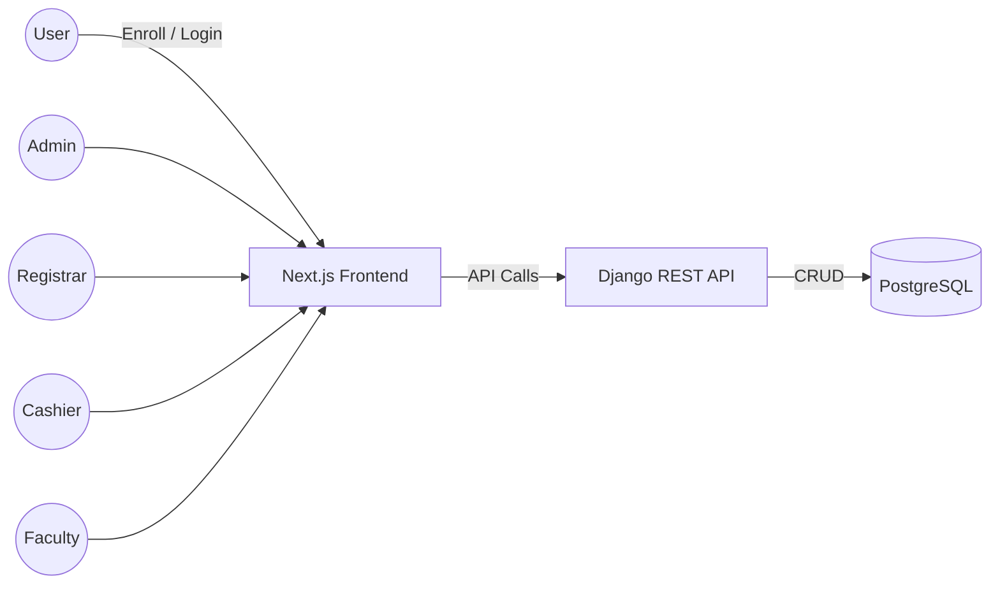
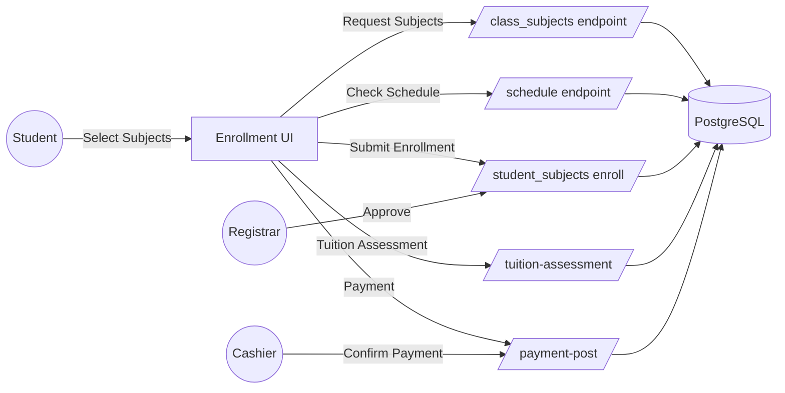
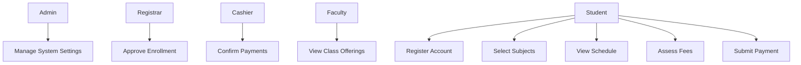
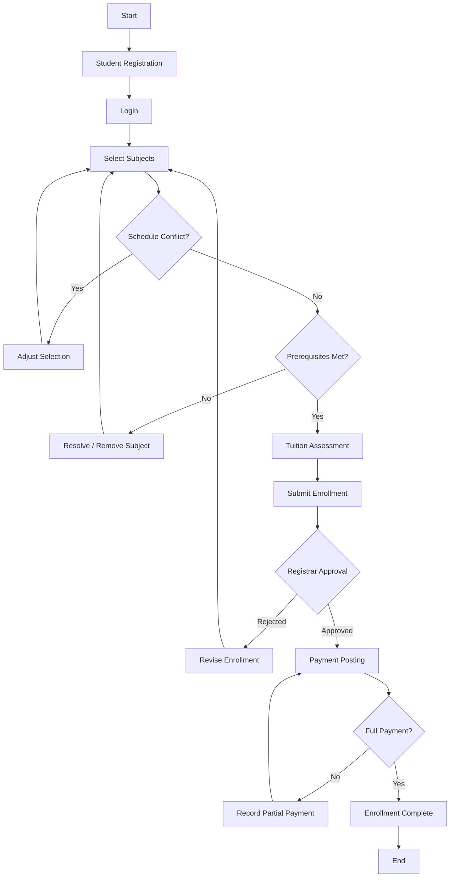

# System Diagrams

## Data Flow Diagram (Level 0)

## Data Flow Diagram (Level 1) - Enrollment

## Use Case Diagram (Textual)

## Activity Diagram - Enrollment Process

## Notes
- ERD tables are accessed via dedicated viewsets prefixed with `erd/`.
- Tuition and payment endpoints are stubs; integrate real fee logic & finance tables when defined.
- Replace placeholder model fields in `erd_models.py` with exact schema before production.
